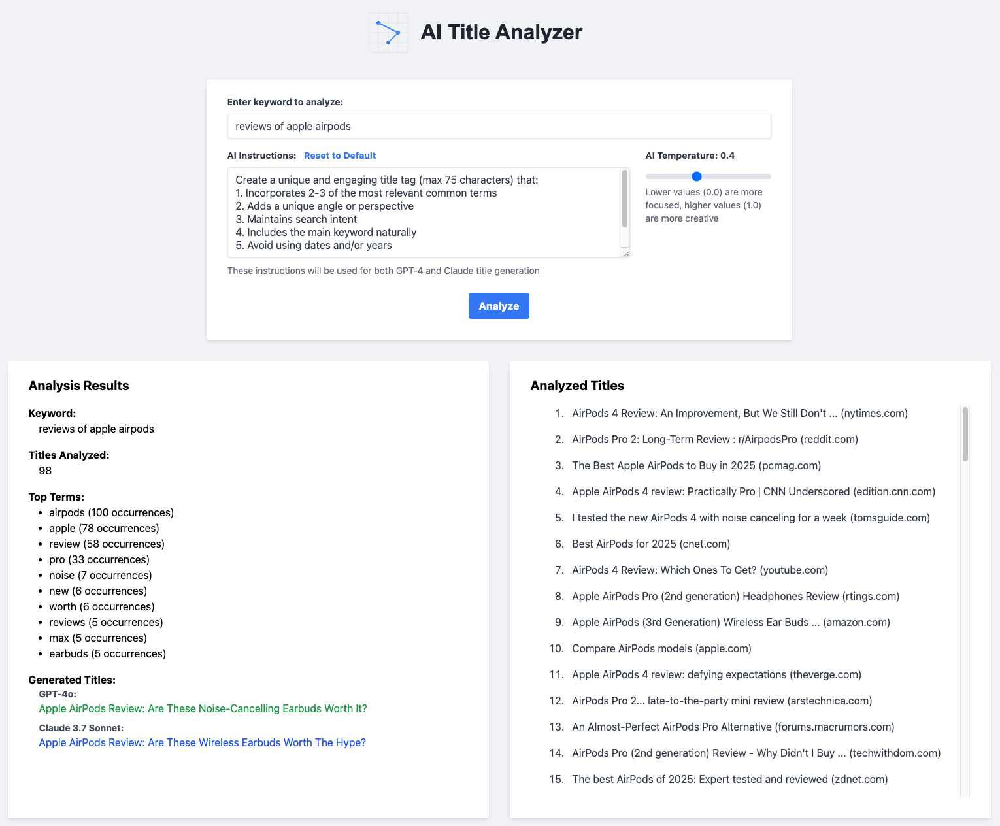

# AI Title Analyzer

A web application that analyzes search engine titles and generates optimized title suggestions using AI. The application can work with either GPT-4, Claude, or both AI models simultaneously.

## Screenshot


## Features

- Scrapes Google search results for any given keyword
- Analyzes common terms and patterns in existing titles
- Generates optimized title suggestions using GPT-4 and/or Claude
- Adjustable AI temperature for creativity control
- Customizable AI instructions with save/reset functionality
- Modern, responsive UI with real-time updates
- Flexible API integration - works with either or both AI services

## Requirements

- Python 3.8+
- Chrome/Chromium for web scraping
- At least one of the following API keys:
  - OpenAI API key (for GPT-4)
  - Anthropic API key (for Claude)

## Installation

1. Clone the repository:
```bash
git clone https://github.com/jefflouella/ai-title-analyzer.git
cd ai-title-analyzer
```

2. Install dependencies:
```bash
pip install -r requirements.txt
```

3. Create a `.env` file in the project root and add your API key(s):
```env
# Add one or both API keys
OPENAI_API_KEY=your_openai_api_key
ANTHROPIC_API_KEY=your_anthropic_api_key
```

## Configuration

The application is flexible in its API usage:
- If both API keys are provided, it will generate titles using both GPT-4 and Claude
- If only OpenAI API key is provided, it will generate titles using only GPT-4
- If only Anthropic API key is provided, it will generate titles using only Claude

## Usage

1. Start the Flask server:
```bash
python app.py
```

2. Open your browser and navigate to `http://localhost:5001`

3. Enter a keyword to analyze

4. (Optional) Adjust settings:
   - Move the temperature slider to control AI creativity (0.0-1.0)
   - Modify the AI instructions in the text area
   - Use "Reset to Default" to restore default instructions

5. Click "Analyze" to generate optimized titles

## How It Works

1. **Search Analysis**: The application scrapes Google search results for your keyword
2. **Term Analysis**: Analyzes the most common terms and patterns in existing titles
3. **AI Generation**: Uses available AI models to generate optimized titles:
   - GPT-4 focuses on SEO-optimized, engaging titles
   - Claude provides alternative perspectives and variations
4. **Results Display**: Shows:
   - Original analyzed titles with their domains
   - Most common terms and their frequencies
   - AI-generated optimized titles from available models

## Troubleshooting

- If you see "OpenAI API key not provided" or "Anthropic API key not provided", check your `.env` file
- If the application doesn't start, ensure port 5001 is available
- For scraping issues, ensure Chrome/Chromium is installed and accessible

## License

MIT License 